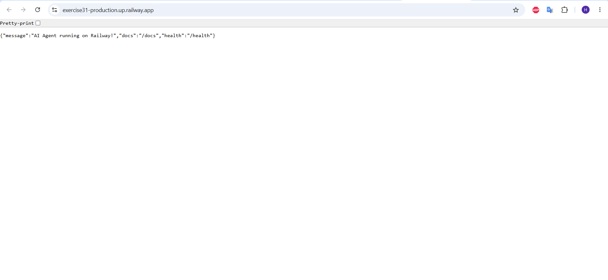

# Day 12 Lab - Mission Answers

> **Student Name:** Thân Văn Hoàng
> **Student ID:** 2A202600582  
> **Date:** 12/06/2026

## Part 1: Localhost vs Production

### Exercise 1.1: Anti-patterns found
1. **API key hardcode trong code:** Gây lộ secret khi push lên hệ thống quản lý source code.
2. **Không có config management:** Cấu hình tĩnh (như debug flag, số lượng tokens) ngay trong code, khó thay đổi trên các môi trường khác nhau.
3. **Sử dụng print thay vì proper logging:** In log ra màn hình kèm cả secret key, không theo định dạng JSON nên khó quản lý bằng các tool log aggregator.
4. **Không có health check endpoint:** Cloud platform sẽ không biết trạng thái sống/chết của agent để tự động restart hoặc cân bằng tải.
5. **Cố định host (`localhost`) và port (`8000`):** App không thể bind với port do Cloud Provider chỉ định (qua biến `PORT`) và không nhận được kết nối từ bên ngoài (`0.0.0.0`).

### Exercise 1.3: Comparison table

| Feature | Basic (Develop) | Advanced (Production) | Tại sao quan trọng? |
|---------|---------|------------|----------------|
| **Config** | Hardcode | Env vars (`.env`) | Bảo mật secret, dễ cấu hình cho nhiều môi trường (dev/prod) mà không cần đổi code. |
| **Health check** | Không có | `/health`, `/ready` | Giúp load balancer/cloud platform theo dõi sức khỏe container, restart nếu lỗi. |
| **Logging** | `print()` | Structured JSON logging | Không ghi secret ra log; dễ parse/query trên các hệ thống như Datadog/ELK. |
| **Shutdown** | Đột ngột (Kill) | Graceful Shutdown | Đảm bảo các request đang thực thi hoàn thành trước khi tắt service, không ngắt đột ngột client. |
| **Port & Host**| Cố định `8000`, `localhost`| Lấy từ biến `PORT`, host `0.0.0.0` | Container có thể nhận traffic từ public và dùng đúng port được Cloud cấp phát. |

## Part 2: Docker

### Exercise 2.1: Dockerfile questions
1. **Base image:** `python:3.11`
2. **Working directory:** `/app`
3. **Tại sao COPY requirements.txt trước?** Để tận dụng Docker layer cache. Nếu `requirements.txt` không thay đổi, Docker không cần phải chạy lại quá trình `pip install` tốn thời gian khi rebuild image.
4. **CMD vs ENTRYPOINT:** `CMD` chỉ định lệnh mặc định được chạy khi khởi chạy container (dễ bị ghi đè khi chạy `docker run`). `ENTRYPOINT` quy định file thực thi cốt lõi luôn chạy, khó bị ghi đè, thường được kết hợp truyền tham số từ `CMD`.

### Exercise 2.3: Image size comparison
- **Develop:** ~1000 MB (do dùng base image `python:3.11` nguyên bản)
- **Production:** ~150 MB (do dùng `python:3.11-slim` kết hợp multi-stage build loại bỏ build tools)
- **Difference:** ~85% nhỏ hơn.

## Part 3: Cloud Deployment

### Exercise 3.1: Deployment
- **URL:** https://exercise31-production.up.railway.app/
- **Screenshot:** 

## Part 4: API Security

### Exercise 4.1-4.3: Test results
```bash
# Không có key -> 401 Unauthorized
curl http://localhost:8000/ask -X POST \
  -H "Content-Type: application/json" \
  -d '{"question": "Hello", "user_id": "test"}'
# Kết quả: {"detail": "Invalid API Key"}

# Gọi có key thành công -> 200 OK
curl http://localhost:8000/ask -X POST \
  -H "X-API-Key: my-secret-key" \
  -H "Content-Type: application/json" \
  -d '{"question": "Hello", "user_id": "test"}'
# Kết quả: {"question":"Hello","answer":"...","model":"..."}

# Test Rate Limiting vượt quá 10 req/min -> 429 Too Many Requests
# Kết quả: {"detail": "Rate limit exceeded"}
```

### Exercise 4.4: Cost guard implementation
```python
import redis
from datetime import datetime

r = redis.Redis.from_url(settings.REDIS_URL)

def check_budget(user_id: str, estimated_cost: float = 0.1) -> bool:
    """Mỗi user có budget $10/tháng, lưu tracking trong Redis."""
    month_key = datetime.now().strftime("%Y-%m")
    key = f"budget:{user_id}:{month_key}"
    
    current = float(r.get(key) or 0)
    if current + estimated_cost > 10.0:
        return False
    
    r.incrbyfloat(key, estimated_cost)
    r.expire(key, 32 * 24 * 3600)  # Giữ data tối đa 32 ngày
    return True
```

## Part 5: Scaling & Reliability

### Exercise 5.1-5.5: Implementation notes
- **Health Checks:** Được cấu hình hai endpoint `/health` (liveness probe báo container còn chạy) và `/ready` (readiness probe báo agent đã connect với Redis/DB để sẵn sàng phục vụ).
- **Graceful Shutdown:** Bắt tín hiệu `SIGTERM` dùng module `signal` hoặc context `lifespan` của FastAPI để đợi các request còn lại chạy xong rồi mới tắt.
- **Stateless Design:** Chuyển bộ nhớ state (như history chat của user) từ dict in-memory sang `Redis` để nhiều server instances có thể dùng chung khi load balancing.
- **Load Balancing:** Dùng Nginx đứng trước 3 replica của server FastAPI để cân bằng các request tới, chứng minh app đã được làm thành stateless.
